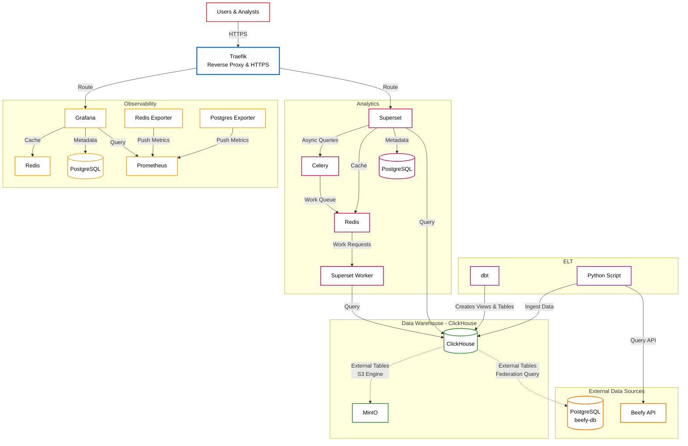
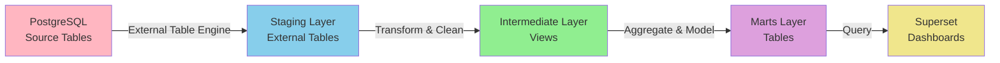

# Beefy Databarn

Full stack data platform for federating multiple external data sources with ClickHouse, dbt, monitoring, and API capabilities.

## Overview

Beefy Databarn is a modern data platform designed to aggregate, transform, and analyze data from multiple external sources (primarily PostgreSQL databases) without requiring data replication. The platform leverages ClickHouse's federation capabilities to query external databases directly, while using dbt for data modeling and transformation. This architecture enables real-time analytics, business intelligence, and monitoring without the overhead of maintaining duplicate data copies.

### Key Concepts

**Data Federation**: Instead of copying data from source databases, ClickHouse uses external table engines (PostgreSQL engine) to query remote databases on-demand. This means:
- No data duplication or storage overhead
- Always up-to-date data (queries hit the source directly)
- Reduced ETL complexity and maintenance

**dbt Data Modeling**: The platform follows a three-layer data modeling approach:
1. **Staging**: External tables that point to source databases (read-only views)
2. **Intermediate**: Data cleaning, standardization, and business logic transformations
3. **Marts**: Business-ready analytical models for consumption (revenue, yield, dimensions)

**Production-Ready Infrastructure**: The platform includes monitoring, security, and orchestration tools for reliable production deployment.

## Architecture



### Component Descriptions

- **ClickHouse**: Columnar analytics database that uses PostgreSQL table engines to federate queries to external databases. Stores transformed data in marts for fast analytical queries.

- **dbt**: Data transformation tool that manages the data modeling pipeline:
  - Creates external tables in ClickHouse pointing to source databases (staging layer)
  - Transforms and cleans data (intermediate layer)
  - Builds business-ready analytical models (marts layer)
  - Runs on a schedule via cron jobs in production

- **Superset**: Business intelligence platform that connects to ClickHouse as a native data source. Analysts can create dashboards, charts, and SQL queries against the dbt models.

- **Traefik**: Reverse proxy that handles:
  - HTTPS termination with Let's Encrypt certificates
  - Routing to internal services
  - Blue-green deployment support

- **Prometheus + Grafana**: Monitoring stack that collects metrics from all services and provides dashboards for infrastructure health, query performance, and system resources.

- **MinIO**: S3-compatible object storage for future data artifacts, backups, and pipeline outputs.

- **Docker Swarm**: Container orchestration for production deployment, enabling high availability and service management across multiple nodes.

## Quick Start

### Prerequisites

- Docker and Docker Compose (for local development)
- Docker Swarm (for production deployment)
- uv (Python package manager)
- Access to external PostgreSQL "beefy-db" database

### Local Development Setup

**Quick start (automated):**
```bash
make setup          # Setup .env and install dependencies
make infra start    # Start infrastructure services (ClickHouse auto-initializes)
make dbt run        # Run dbt models
```

**Manual setup:**

1. Clone the repository and run initial setup:
   ```bash
   make setup
   # Or manually:
   cp .env.example .env  # Edit .env with your credentials
   uv sync               # Install dependencies
   ```

2. Start infrastructure services:
   ```bash
   make infra start      # Start ClickHouse, Superset, Grafana, Prometheus, MinIO
   # ClickHouse automatically initializes on first startup
   ```

3. Run dbt models:
   ```bash
   make dbt run          # Run all models
   make dbt test         # Run tests
   ```

4. Access services:
   - ClickHouse: http://localhost:8123
   - Superset: http://localhost:8088
   - Grafana: http://localhost:3000 (admin/changeme by default)
   - Prometheus: http://localhost:9090
   - MinIO Console: http://localhost:9001 (admin/changeme by default)
   - MinIO API: http://localhost:9002

**Other useful commands:**
```bash
make help             # Show all available commands
make infra logs       # View infrastructure logs
make infra ps         # Check service status
make infra stop       # Stop all services
```

### Production Deployment (Docker Swarm)

1. Follow steps 1-2 from Local Development Setup
2. Navigate to production directory:
   ```bash
   cd infra/prod
   ```

3. Build and deploy infrastructure:
   ```bash
   # Build images (dbt, superset, etc.)
   make build

   # Deploy stack
   make deploy
   # Or combine: make deploy (builds and deploys)
   ```

4. ClickHouse automatically initializes on first startup via init script

5. Run dbt models (dbt runs on a schedule via cron in production):
   ```bash
   # Or manually trigger from dbt container:
   docker exec -it <dbt-container> /app/run_dbt.sh
   ```

**Production Management:**
```bash
cd infra/prod
make ps              # Show running services
make logs            # View logs from all services
make up              # Rolling update (redeploy stack)
```

## Project Structure

- `infra/`: Infrastructure configurations (dev/prod stacks, ClickHouse, Superset, Traefik, monitoring)
  - `infra/prod/`: Production deployment files (Makefile, docker-stack.yml, docker-compose.build.yml)
  - `infra/dev/`: Development docker-compose configuration
  - `infra/dbt/`: dbt container configuration (Dockerfile, cron jobs)
- `dbt/`: dbt project with staging, intermediate, and marts models
- `dlt/`: Future data ingestion pipelines
- `hasura/`: Future GraphQL API setup

## dbt Models

The dbt project follows best practices with three layers that progressively transform raw source data into business-ready analytical models.

### Data Flow



### Layer Details

1. **Staging** (`models/staging/`): 
   - Creates ClickHouse external tables using PostgreSQL table engines
   - These tables act as read-only views that query the source database on-demand
   - No data is copied; queries are federated to PostgreSQL
   - Example: `stg_beefy_db__harvests` queries the `harvests` table from beefy-db PostgreSQL
   - Materialized as views (no storage overhead)

2. **Intermediate** (`models/intermediate/`):
   - Cleans and standardizes data from staging
   - Handles data quality issues (nulls, invalid values, outliers)
   - Applies business logic and calculations
   - Joins related tables and enriches with dimension data
   - Example: `int_price` standardizes price data across sources
   - Materialized as views for flexibility

3. **Marts** (`models/marts/`):
   - Business-ready analytical models organized by domain
   - **Dimensions** (`dimensions/`): Reference data (chains, products)
   - **Revenue** (`revenue/`): Revenue-generating events (buyback events)
   - **Yield** (`yield/`): Yield-generating events (harvest events)
   - Optimized for analytical queries with proper indexing
   - Materialized as tables for query performance

### Example: Harvest Events Flow

1. **Source**: PostgreSQL `harvests` table contains raw harvest transaction data
2. **Staging**: `stg_beefy_db__harvests` creates an external table that queries PostgreSQL directly
3. **Intermediate**: Data is cleaned (filters invalid prices, removes outliers)
4. **Marts**: `yield_harvest_events` joins with dimensions (chain, product) and calculates USD values
5. **Consumption**: Superset queries `yield_harvest_events` for dashboards and analytics

## Development

### Available Commands

View all commands:
```bash
make help
```

### Infrastructure Management
```bash
make infra start    # Start infrastructure services
make infra stop     # Stop infrastructure services
make infra restart  # Restart infrastructure services
make infra build    # Rebuild infrastructure images
make infra logs     # View logs
make infra ps       # Check service status
```

### dbt Commands
```bash
make dbt run        # Run all models
make dbt test       # Run tests
make dbt compile    # Compile models
make dbt docs       # Generate and serve documentation
```

### Full Workflows
```bash
make dev            # Complete setup: install deps, start services, run dbt
make infra start    # Start infrastructure services
```

### Direct Commands (without make)

If you prefer to use docker-compose and dbt directly:
```bash
# Infrastructure (from project root)
docker-compose -f infra/dev/docker-compose.yml up -d
docker-compose -f infra/dev/docker-compose.yml logs -f
docker-compose -f infra/dev/docker-compose.yml down

# dbt
cd dbt && uv run dbt run
cd dbt && uv run dbt test
```

## Deployment

The platform supports both development and production environments:

- Development: `infra/dev/docker-stack.yml`
- Production: `infra/prod/docker-stack.yml`

Services can be moved between nodes using Docker Swarm labels.

## Monitoring & BI

- Superset: http://localhost:8088 (local dev) or https://redash.${TRAEFIK_DOMAIN} (production)
- Grafana: http://localhost:3000 (default)
- Prometheus: http://localhost:9090
- ClickHouse: http://localhost:8123

**Note**: Superset supports ClickHouse as a native data source. After initial setup, you can configure ClickHouse connections through the Superset UI to query your dbt models and data.

## Security

- Traefik HTTPS termination with Let's Encrypt
- Docker Swarm network isolation
- Service-level security configurations in docker-stack.yml

